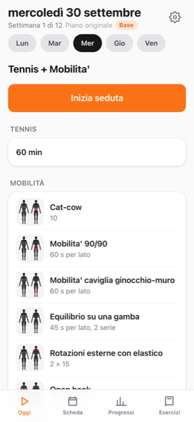
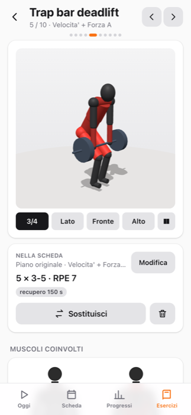
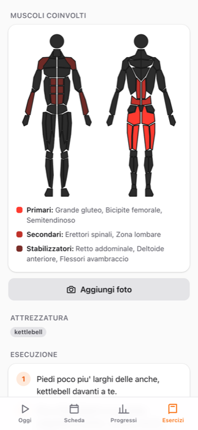
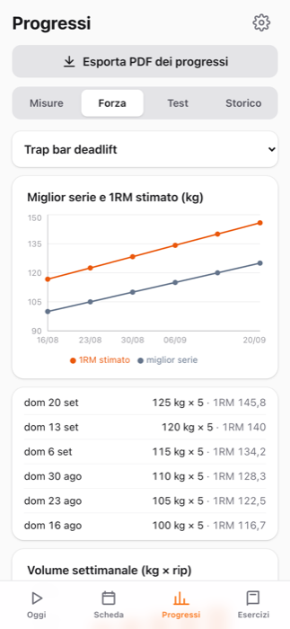
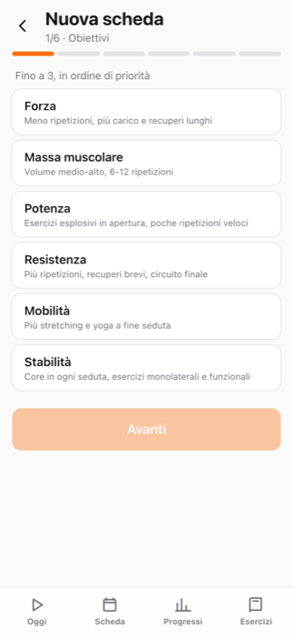

# Allenamento

App personale per seguire una scheda di allenamento, registrare le sedute e vedere i progressi. Funziona su iPhone e Mac come app installata (PWA), anche offline, e non ha server né account: i dati restano sul dispositivo.

**Apri l'app:** https://tommasotorda.github.io/allenamento/

<p>
  
  
  
  
  
</p>

## Cosa fa

- **Oggi**: la seduta del giorno con serie precompilate dall'ultima volta, carico suggerito, RPE, timer di recupero, pista, circuiti a tempo e riepilogo finale. Si registra tutto con tap e stepper.
- **Scheda**: la settimana e il ciclo di 12 settimane con le fasi (base, forza, scarichi, test). Ogni seduta si modifica: aggiungi, togli, sostituisci e riordina gli esercizi, cambia serie, ripetizioni, tempi e recuperi.
- **Più schede**: crea una scheda dal **questionario** (obiettivi, livello, giorni, durata fino a 2 ore, attrezzatura, corpo libero, zone su cui concentrarti o da non sollecitare) o da un **profilo standard**. Puoi anche salvare le tue schede come profili.
- **Adattamenti**: trasforma la scheda verso forza, massa, potenza, resistenza, mobilità o stabilità, anche combinate. L'app lo propone alla scadenza (12 settimane), dopo i test di metà ciclo, a metà delle sedute o quando il 1RM stimato cresce del 10%.
- **Esercizi**: 102 esercizi (forza, funzionali, core, catena posteriore, schiena, potenza, pista, mobilità, stretching, yoga). Per ciascuno:
  - animazione 3D che si ruota con il dito;
  - mappa dei muscoli coinvolti (primari, secondari, stabilizzatori);
  - esecuzione passo per passo e storico.

  Uno swipe passa all'esercizio successivo della seduta, e dalla stessa schermata puoi modificarlo, sostituirlo con uno affine o toglierlo.
- **Progressi**: peso con media mobile, circonferenza vita, FC a riposo, forza per esercizio con 1RM stimato, volume settimanale, test e storico delle sedute.
- **PDF**:
  - la scheda è navigabile, con indice, pulsanti per giorno e viste Scheda / Muscoli / Dettaglio;
  - i progressi hanno grafici e tabelle.

  Su iPhone si condividono dal menu Condividi.
- **Backup**: esporta e importa tutti i dati, foto comprese, in un file JSON.

## Installazione

**iPhone**: apri il link in Safari → Condividi → *Aggiungi alla schermata Home*.
**Mac**: apri il link in Safari → *File → Aggiungi al Dock*.

Ogni dispositivo ha i suoi dati. Per spostarli usa *Impostazioni → Esporta / Importa dati*.

## Sviluppo

Richiede Node.js 22 o successivo.

```sh
npm install
npm run dev        # sviluppo su http://localhost:5173
npm test           # test della logica (Vitest)
npm run build      # valida i dati, controlla i tipi e crea dist/
npm run validate   # controlla esercizi, muscoli, figure e programma
```

Stack: React 19, TypeScript, Vite, Tailwind CSS, Dexie (IndexedDB), React Router, Recharts, three.js, jsPDF, vite-plugin-pwa.

La struttura del codice, le convenzioni e i vincoli sui testi dell'app sono descritti in [CLAUDE.md](CLAUDE.md).

## Pubblicazione

Ogni push sul branch `main` esegue test e build e pubblica su GitHub Pages con GitHub Actions (`.github/workflows/deploy.yml`). L'app installata si aggiorna da sola alla riapertura.

## Note

- Immagini, animazioni e mappe muscolari sono generate dal codice: niente immagini di terze parti.
- Programmi, parametri e coinvolgimento muscolare degli esercizi sono indicativi e non sostituiscono il parere di un professionista.
